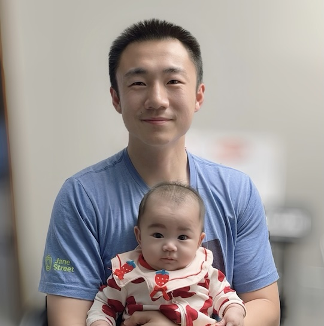
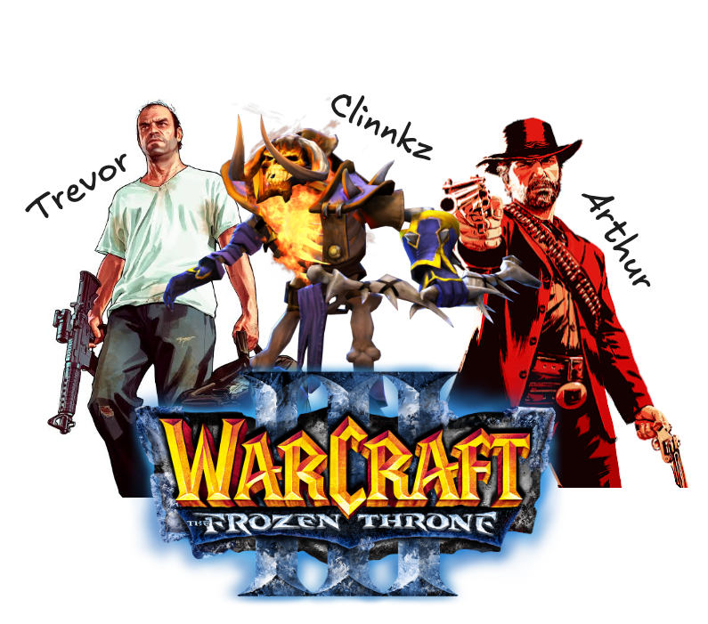
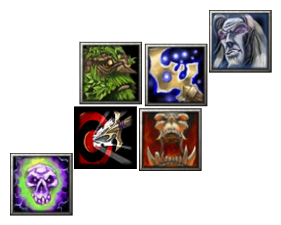

I am a **Research Scientist** at **Intuit** (Dec 2024 – present). Ph.D. in Computer Science from **Michigan State University**, advised by [Prof. Sijia Liu](https://lsjxjtu.github.io/). B.S. in Automation from **Tsinghua University**.

My research focuses on **LLM Agents**, **Adversarial Machine Learning**, **Model Pruning**, **Prompt Learning**, and **Optimization** (black-box, bi-level).

**Email:** tony.yuguang.yao@gmail.com &nbsp;\|&nbsp; [CV](CV_Yuguang_Yao_Mar20.pdf) &nbsp;\|&nbsp; [Google Scholar](https://scholar.google.com/citations?user=-chIdAkAAAAJ&hl=en) &nbsp;\|&nbsp; [GitHub](https://github.com/yaoyugua) &nbsp;\|&nbsp; [LinkedIn](https://www.linkedin.com/in/tonyyaomsu/)

---

## Education

- **Ph.D. in CSE**, Michigan State University, Jan 2021 – Dec 2024. Advisor: Sijia Liu
- **Ph.D. Student in CSE**, Tsinghua / MSU, Aug 2018 – Dec 2020. Advisors: Zhichao Cao, Yunhao Liu
- **B.S. in Automation**, Tsinghua University, Aug 2014 – Jul 2018. Advisor: Hong Wang
- **Exchange**, École Polytechnique Fédérale de Lausanne (EPFL), Aug 2016 – Feb 2017

---

## Experience

- **Research Scientist**, Intuit AI Research, Dec 2024 – Present
- **Research Intern**, Cisco Research, Feb 2023 – Jun 2024. Advisor: Gaowen Liu
- **Research Intern**, MIT-IBM Watson AI Lab, May 2021 – Aug 2021. Advisor: Quanfu Fan
- **Research Intern**, DiDi AI Lab, Nov 2017 – Feb 2018. Advisor: Yashu Liu
- **Research Intern**, HKUST, Jun 2017 – Sep 2017. Advisor: Pan Hui

---

## Selected Publications

1. Y. Yao\*, Y. Chen\*, et al., **Safety Mirage: How Spurious Correlations Undermine VLM Safety Fine-Tuning**, *ICLR 2026*.
2. K. Chen, Z. Lin, ..., Y. Yao, et al., **R2I-Bench: Benchmarking Reasoning-Driven Text-to-Image Generation**, *ACL 2025*.
3. Y. Yao\*, J. Liu\*, et al., **Can Adversarial Examples Be Parsed to Reveal Victim Model Information?**, *WACV 2025*.
4. Y. Yao\*, Z. Pan\*, et al., **From Trojan Horses to Castle Walls: Unveiling Bilateral Backdoor Effects in Diffusion Models**, *NeurIPS 2024*.
5. Y. Yao, G. Xiao, et al., **Reverse Engineering of Deceptions on Machine- and Human-Centric Attacks**, *Foundations and Trends in Privacy and Security 2024*.
6. S. Pal, Y. Yao, et al., **Backdoor Secrets Unveiled: Identifying Backdoor Data with Optimized Scaled Prediction Consistency**, *ICLR 2024*.
7. J. Jia\*, J. Liu\*, ..., Y. Yao, et al., **Model Sparsity Can Simplify Machine Unlearning**, *NeurIPS 2023 Spotlight*.
8. A. Chen, Y. Yao, et al., **Understanding and Improving Visual Prompting: A Label-Mapping Perspective**, *CVPR 2023*.
9. Y. Yao\*, Y. Zhang\*, et al., **Advancing Model Pruning via Bi-level Optimization**, *NeurIPS 2022*.
10. Y. Yao\*, Y. Gong\*, et al., **Reverse Engineering of Imperceptible Adversarial Image Perturbations**, *ICLR 2022*.
11. Y. Zhang, Y. Yao, et al., **How to Robustify Black-Box ML Models? A Zeroth-Order Optimization Perspective**, *ICLR 2022 Spotlight*.

---

## Service & Awards

- **Workshop Chair**: AdvML Frontiers at ICML'22, ICML'23, NeurIPS'24
- **Reviewer**: NeurIPS, ICLR, ICML, ACL, CVPR, ACMMM, ICASSP, TPAMI
- **Travel Grants**: NeurIPS 2022, CVPR 2023, NeurIPS 2024
- **Best Poster Award**, EWSN 2019
- **Cisco Research Award** ($75K) for "Towards Lifelong LMM Agents in Embodied AI"

---

## 学习

小时候，学习是完成确定的任务；现在，学习是解决不确定的恐慌。以前总以为，活到老、学到老是鞭策中国人持续进步的口号；现在能理解，那其实是聪明的过来人对一种实现幸福的方式的总结。刚读博士的时候，导师和我说，无论每天做什么，总要留出一些时间写文字，写什么都可以。我一直到最近才能体会到，刷八个小时短视频只会让你失去八个小时，写三十分钟文字，你至少得到了一些文字。 --2026年6月1日

## 思维实验

Kevin说不刷小视频的时候可以进行脑中思维实验，他叫这是白日梦，我叫这是沉思。可以从梦幻西游里面想象三头六臂的地狱战神在我家里敲锣打鼓，我如何用我的金背大砍刀破它的紫色皮肤。星际争霸里面有成群结队的大和星舰在我家的上空和神族航空母舰对轰。人生的curriculum learning真是神奇，小时候最喜欢玩的游戏们永远都会在我的30岁的幻想中反复出现，让我在头痛欲裂的职场工作里会心一笑。 --2026年6月2日

## 不想起床

生物钟把我在七点钟拉起来，我却想要继续睡。为什么不想起床？为什么嗜睡？是因为心中没有对当日生活的期待，是缺少对未来、新生活的探索欲望。人的状态会有起伏，但不必要的放大效应应该被避免。突然想起大学同学总提的“苦行僧”式的生活理念，大概保持对幸福的低期待，是持续清醒的实现手段之一吧。 --2026年6月3日

## 大秘宝

海贼王哥尔D罗杰把他的财富都放在拉夫德鲁了，而我的大秘宝也被你看到了。 --2026年6月3日

## 做梦

小时候高中在家乡健身房“中体倍力”洗澡，练肌肉，有不少好朋友和同学。北方健身房呢，洗澡没有帘子或者隔断，大家多少坦诚相见。有大有小，肌肉块头也罢，身材天赋也罢，但大多能接受，在见识范围之内。我有个初高中六年的好哥们儿，叫李哥，打球啥的运动天赋真不错，不过倒是没见过他怎么举重练肉，那天也在游泳池见到了。打个招呼，我先练完就去洗漱了。我记得当时我哼唱小曲，闭眼抹头，突然一睁眼，一把黑，以为是什么外国黑人来了我们这太原小地方：如西游记，正是百川汇处擎天柱，万劫无移大地根: “唉姚哥洗澡呢？”自那时起，我都对脸长脚长的哥们儿们敬佩三分。而李哥呢，我后来就叫他大李哥了。 

## 铁生走了。他腿好了？

昨天早起开车去大天堂城市沙滩。路上我老婆和翔老婆饿了，我们去吃饭。吃鸡肉填满A，我吃了限定辣炸鸡汉堡，喝了没有能量柠檬水；老婆买了降落伞奶牛玩偶，吃了常规不辣炸鸡汉堡；翔和翔老婆吃了常规不辣炸鸡汉堡，把薯格换成鸡肉面条汤，但不吃饼干。吃完继续开车去大天堂城市沙滩。我们磊城堡，堆山丘，挖隧道，追海鸥，喝牛奶，看海湖，见高阳，赏白肚。翔说我有活力，老婆说我有劲，我累了晒了，说回家，回家去奥克莫司。路上我和翔饿了，我们去吃饭，吃卡尔瓦斯，我吃了限定辣炸鸡汉堡，喝了没有能量可乐水；翔吃了限定辣牛肉汉堡，翔吃了瑞士蘑菇牛肉汉堡，把薯条换成了肉泥芝士薯条，不如蘸番茄酱。吃完继续开车回奥克莫司。尻吃毛血旺，今天我也要吃毛血旺。

## 开卷有益，行路膝盖痛

连续掼蛋了一个月，打牌打得昏天黑地。胡适先生忏悔打牌，然后继续打牌。我倒是不忏悔，不过瘾大得确实有些令自己震惊。自从老婆把科比领会家之后，家里的猫屎越来越臭了。老猫们也不用高科技滚屎桶，全都回归旧学校，在小猫的马桶里堆积如山。今天和蔻蔻绕着小区走了很远的路，路上花了一个半小时。大家都找不到我了，很担心。我在路上想如果我能多读些书而不是多打这么多篮球就好了，那样我的膝盖也不会这么痛了。

## 7月6日，我的妈妈

美好的一个月很快地就过去了，距离在这个地方第一次写东西也过去了一个月了。哈兰德进了很多球，姆巴佩进了很多球，梅西进了很多球。掼蛋技术有所长进，这是一个变化很多的纸牌游戏。膝盖没那么痛了，但也不到下地打篮球的程度。Rexpand Team一直给我发消息说认识很多THU+MSU的同学又换了工作，我不信。

## 7月7日，今天的膝盖还是很痛

回到旧金山的第一天，今天和老板聊了项目、谈了规划，大概知道领导们期望什么样的汇报。故事，结论，而不是大量的疑问。大量的疑问抛给没有和你一起写代码的领导，他们也只能回复给你更多的疑问和猜测。持续的低压不是痛苦的来源，没有对生活的冲劲和激情才是。我的女儿很可爱很漂亮，我希望你们的也是。

## 退休计划，Kobe

如果我退休了，我要天天去健身，把肩膀练大，把胳膊练粗，把屁股练肥。我要去洛杉矶海边租一个1000刀的一床房，去圣塔莫妮卡沙滩，去曼哈顿沙滩，去马里布沙滩。我要去找我的好哥们一起打篮球，打完篮球去洗澡，洗完澡去打魔兽，打完魔兽去睡觉，睡觉起来打篮球。吃好吃的鸡肉，吃好吃的米饭，喝好喝的咖啡，拉好夯的引体向上，蹲好深的臀蹲。背阔肌可以遮天蔽日，臀大肌可以包罗万象。图库里每天都有十几个要发布在微信频道里的小视频，给大家展示十八岁的图。

## 支线任务

今天在脆看到几件值得去做的支线任务：走进一家书店买下随手拿到的书；找一家无网红光顾的咖啡厅变成秘密基地；开始写日记；一天称赞五个陌生人；独处24小时没有手机没有其他人。

## 元素拼接

## DNA

## 记录

我昨天问师兄有哪一个球员能在连续两届世界杯以核心球员获得总冠军，他说没有吧，我说贝利算吗，他想到贝利卫冕那次早早退场了，不算核心。再去问谷歌，有1934-1938的朱塞佩；有1958-1962的加林查。今年谁有可能呢？

<h2>讨论 Discussion</h2>

<a href="https://github.com/yaoyugua/yaoyugua.github.io/discussions" target="_blank" rel="noopener">在 GitHub Discussions 查看全部 →</a>

